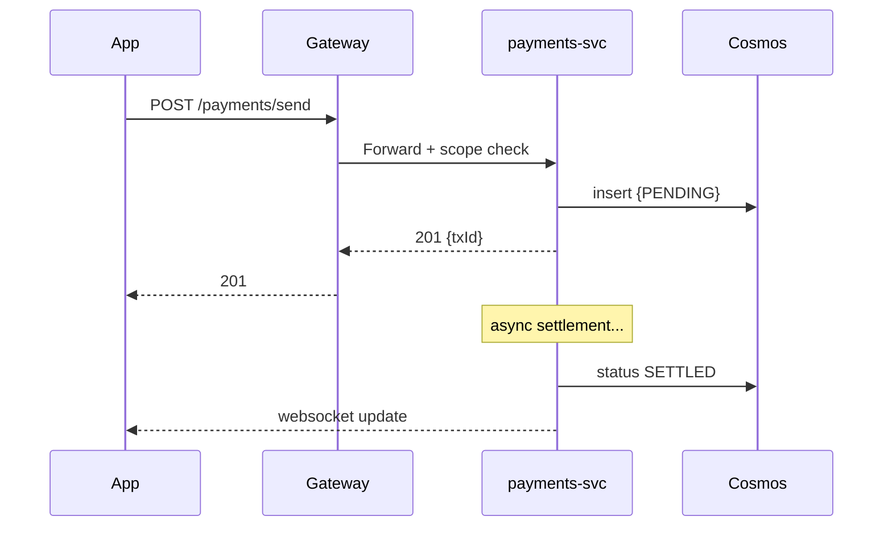
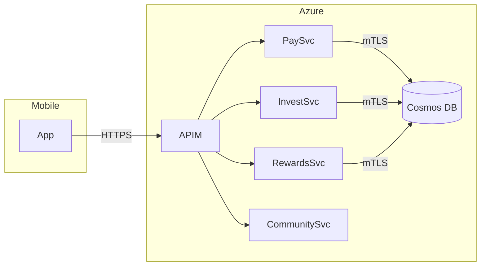

# Sequence & Component Diagrams

## Cash Send (Sequence)

```mermaid
sequenceDiagram
  participant App
  participant Gateway
  participant PaySvc as payments‑svc
  participant Cosmos

  App->>Gateway: POST /payments/send
  Gateway->>PaySvc: Forward + scope check
  PaySvc->>Cosmos: insert {PENDING}
  PaySvc-->>Gateway: 201 {txId}
  Gateway-->>App: 201
  Note over PaySvc: async settlement...
  PaySvc->>Cosmos: status SETTLED
  PaySvc-->>App: websocket update
```

## Component View

```mermaid
graph LR
  subgraph Mobile
    App
  end
  subgraph Azure
    APIM
    PaySvc
    InvestSvc
    RewardsSvc
    CommunitySvc
    Cosmos[(Cosmos DB)]
  end
  App -- HTTPS --> APIM
  APIM --> PaySvc
  APIM --> InvestSvc
  APIM --> RewardsSvc
  APIM --> CommunitySvc
  PaySvc -- mTLS --> Cosmos
  InvestSvc -- mTLS --> Cosmos
  RewardsSvc -- mTLS --> Cosmos
```
